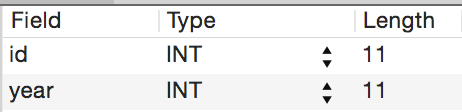
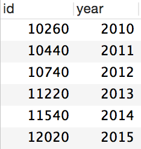
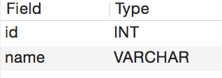
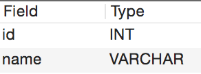
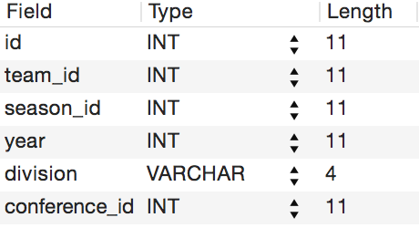
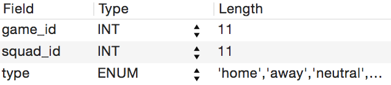
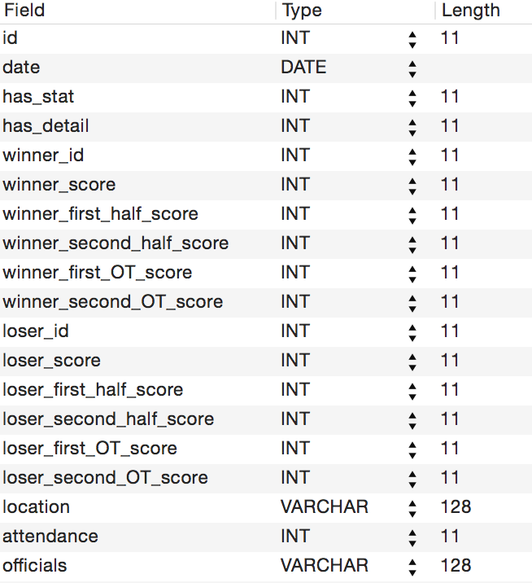
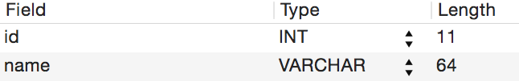

Database design
===============
The database is designed based on `stats.ncaa.org <http://stats.ncaa.org/>`_

Season table
------------
Use ncaa_id to determine season and gender, no matter what the division is.

The data entry must be manually inserted into table, because we can not predict
the season_id that ncaa will use for the next season. Men and Women will use
same season_id for the same season.

Table structure:

Table content (until season 2014/2015):

Conference table
----------------
A team may belong to different conference in different year and division.

So conference will have one-to-one maps to Squad.

Table structure:

Team table
----------
Teams contain a relationship to Squads for any available years.
Also contain relationships to alternate team names.

NCAA uses a permanent id (org_id, which is also known as ncaa_id)to
represent a team no matter what the season is.

Note that IDs have been assigned explicitly to match those used by
NCAA.com to make record linkage easier. The alternate team names
and fuzzy matching capabilities are just in case another source is
used.

One-to-many maps to Squads.

Table structure:

Squad table
-----------
Squads contain basic information of a Team in a given season.

One-to-many maps to SquadMembers, Games. Many-to-one map to Team.

Table structure:

Schedule table
--------------
One game will have two schedules for both team, indicate which one is
home team, and which one is away team.

NCAA will post all schedules for the whole season, and fill the game
details when match is complete.

Table structure:

Game table
----------
Game holds references to two Squads. Holds a collection of total score,
first & second half score, first & second overtime score.
Allow for specification of winner and loser.
Also hold vital statistics such as where and when and attendance.

Many-to-many map to Squads via Schedule, one-to-many map to PlayerGameStat.

Table structure:

Player table
------------
Players possess a one-to-many mapping to SquadMembers,
which are essentially chrono-sensitive versions of the Player. For
example, a Player's corresponding SquadMember from 2010-11 will not
have access to that Player's statistics from 2011-12, nor will these
latest statistics be incorporated into the earlier SquadMember's record.
This allows for more realistic simulations.

Table structure:

SquadMember table
-----------------
This is the class that holds Player's basic information.
Many-to-one maps to Player, Squad, and Game

Table structure:

PlayerSeasonStat table
----------------------
Contains the stats of one SquadMember in one Season

Many-to-one maps to SquadMember

Table structure:

SquadSeasonStat table
---------------------
Contains the stats of one Squad in one Season.

one-to-one maps to Squad.

Table structure:

PlayerGameStat table
--------------------
Contains the stats of one SquadMember in one Game

Many-to-one maps to SquadMember and many-to-one maps
to Game.

Table structure:

SquadGameStat table
-------------------
Contains the stats of one Squad in one Game

Many-to-one maps to Squad and Game

Table structure:

GameDetail table
----------------
Play-by-Play information

Many-to-one maps to Game.

Table structure:

